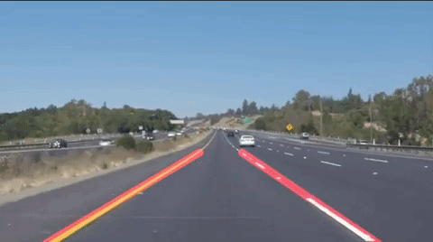

# **Finding Lane Lines on the Road** 

# Project 1

### Youtube - https://youtu.be/SvEiPJpGhac

### Solid Yellow Left

### Solid White Right

### My Pipeline consisted of 6 steps:

1. Conversion of image to grayscale using the grayscale() function.
2. Applying Gaussian blur on the image using the gaussian_blur() function.
3. Converting image to an image with only edges using Canny edge detection. If high contrast in pixel value is found,it is considered as an edge and is detected using the canny() function.
4. To remove unwanted area, the image is masked to remove the unwanted portion using the region_of_interest() helper function.
5. Hough transform is used thereafter via Open CV method which helped connecting lines, we are interested in and in eliminating the rest. In this step we also used the draw_lines() method to add lines over the lanes in the image and extrapolate them.
6. Last step was to merge both the modified image and the original one to produce the result using the weighted_img() function.

---

### Output Images without extrapolated lane lines:

---

### Modification of draw_line() helper function:

The draw_lines() function has to be modified in order to extrapolate/average/connect the lane lines. For this, created two dictionaries, left_lane_longest{} and right_lane_longest{} to store slope, intercept and length. The slope is calculated for each and every point unless their x -coordinate is equal. On the basis of slope the left and right lanes and segregated. Iteration is done on all the lines that are returned by the hough transform to plot the longest found line.

---

### Potential shortcomings with my current pipeline:

The only drawback is that when I try to run the "challenge.mp4" video, the lane lines are not recognised correctly. There is a lot of flickering and wrong detection in between when the road is curved left or right. This means the current pipeline is not so good for curved roads.

---

### Possible improvements:

Improvements in the Pipeline are needed so that the curved lane lines are also detected without any error. Moreover, the autonomous car will face all kind of road conditions, so some changes must be made to the pipeline in order to make the lane finding error free. The pipeline should be redefined in such a way so that the "challenge.mp4" video is also detected error free.
